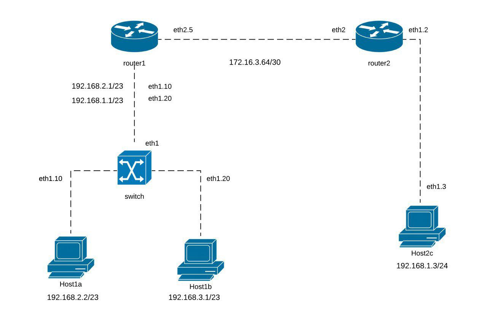

# DNCS-LAB

This repository contains the Vagrant files required to run the virtual lab environment used in the DNCS course.
```


        +-----------------------------------------------------+
        |                                                     |
        |                                                     |eth0
        +--+--+                +------------+             +------------+
        |     |                |            |             |            |
        |     |            eth0|            |eth2     eth2|            |
        |     +----------------+  router-1  +-------------+  router-2  |
        |     |                |            |             |            |
        |     |                |            |             |            |
        |  M  |                +------------+             +------------+
        |  A  |                      |eth1                       |eth1
        |  N  |                      |                           |
        |  A  |                      |                           |
        |  G  |                      |                     +-----+----+
        |  E  |                      |eth1                 |          |
        |  M  |            +-------------------+           |          |
        |  E  |        eth0|                   |           |  host-c  |
        |  N  +------------+      SWITCH       |           |          |
        |  T  |            |                   |           |          |
        |     |            +-------------------+           +----------+
        |  V  |               |eth2         |eth3                |eth0
        |  A  |               |             |                    |
        |  G  |               |             |                    |
        |  R  |               |eth1         |eth1                |
        |  A  |        +----------+     +----------+             |
        |  N  |        |          |     |          |             |
        |  T  |    eth0|          |     |          |             |
        |     +--------+  host-a  |     |  host-b  |             |
        |     |        |          |     |          |             |
        |     |        |          |     |          |             |
        ++-+--+        +----------+     +----------+             |
        | |                              |eth0                   |
        | |                              |                       |
        | +------------------------------+                       |
        |                                                        |
        |                                                        |
        +--------------------------------------------------------+


```

# Requirements
 - Python 3
 - 10GB disk storage
 - 2GB free RAM
 - Virtualbox
 - Vagrant (https://www.vagrantup.com)
 - Internet

# How-to
 - Install Virtualbox and Vagrant
 - Clone this repository
`git clone https://github.com/dustnic/dncs-lab`
 - You should be able to launch the lab from within the cloned repo folder.
```
cd dncs-lab
[~/dncs-lab] vagrant up
```
Once you launch the vagrant script, it may take a while for the entire topology to become available.
 - Verify the status of the 4 VMs
 ```
 [dncs-lab]$ vagrant status                                                                                                                                                                
Current machine states:

router                    running (virtualbox)
switch                    running (virtualbox)
host-a                    running (virtualbox)
host-b                    running (virtualbox)
```
- Once all the VMs are running verify you can log into all of them:
`vagrant ssh router`
`vagrant ssh switch`
`vagrant ssh host-a`
`vagrant ssh host-b`
`vagrant ssh host-c`

# Assignment
This section describes the assignment, its requirements and the tasks the student has to complete.
The assignment consists in a simple piece of design work that students have to carry out to satisfy the requirements described below.
The assignment deliverable consists of a Github repository containing:
- the code necessary for the infrastructure to be replicated and instantiated
- an updated README.md file where design decisions and experimental results are illustrated
- an updated answers.yml file containing the details of

## Design Requirements
- Hosts 1-a and 1-b are in two subnets (*Hosts-A* and *Hosts-B*) that must be able to scale up to respectively 273 and 504 usable addresses
- Host 2-c is in a subnet (*Hub*) that needs to accommodate up to 251 usable addresses
- Host 2-c must run a docker image (dustnic82/nginx-test) which implements a web-server that must be reachable from Host-1-a and Host-1-b
- No dynamic routing can be used
- Routes must be as generic as possible
- The lab setup must be portable and executed just by launching the `vagrant up` command

## Tasks
- Fork the Github repository: https://github.com/dustnic/dncs-lab
- Clone the repository
- Run the initiator script (dncs-init). The script generates a custom `answers.yml` file and updates the Readme.md file with specific details automatically generated by the script itself.
  This can be done just once in case the work is being carried out by a group of (<=2) engineers, using the name of the 'squad lead'.
- Implement the design by integrating the necessary commands into the VM startup scripts (create more if necessary)
- Modify the Vagrantfile (if necessary)
- Document the design by expanding this readme file
- Fill the `answers.yml` file where required (make sure that is committed and pushed to your repository)
- Commit the changes and push to your own repository
- Notify the examiner that work is complete specifying the Github repository, First Name, Last Name and Matriculation number. This needs to happen at least 7 days prior an exam registration date.

# Notes and References
- https://rogerdudler.github.io/git-guide/
- http://therandomsecurityguy.com/openvswitch-cheat-sheet/
- https://www.cyberciti.biz/faq/howto-linux-configuring-default-route-with-ipcommand/
- https://www.vagrantup.com/intro/getting-started/


# Design

## Subnets and IP addresses

The IP addresses assigned were chosen following the requirements specified in the answers.yml file. The class of IP addresses used is 192.168.0.0/16:

    "Host-A" must scale up to 273 usable addresses, it contains Host-A and 237 other hosts + router-1 port eth1
    "Host-B" must scale up to 504 usable addresses, it contains Host-B and 6 other hosts + router-1 port eth1
    "Host-C" must scale up to 251 usable addresses, it contains Host-C and 3 other hosts + router-2 eth1
    "Router" must have 2 addresses for router-1 eth2 port and router-2 eth2 port  


| Device       | Network       | Subnet              |  Broadcast    | Hosts | Host-min      | Host-max      |
|--------------|---------------|---------------------|---------------|-------|---------------|---------------|
| Host-a       | 192.168.2.0   | 255.255.254.0 - /23 | 192.168.3.255 | 510   | 192.168.2.1   | 192.168.2.254 |
| Host-b       | 192.168.3.0   | 255.255.254.0 - /23 | 192.168.9.255 | 510   | 192.168.8.1   | 192.168.9.254 |
| Host-c       | 192.168.1.0   | 255.255.255.0 - /24 | 192.168.1.255 | 254   | 192.168.1.1   | 192.168.1.254 |
| Router       | 10.0.0.0      | 255.255.255.252 -/30| 10.0.0.7      | 2     | 10.0.0.5      | 10.0.0.6      |

## VLANs
The subnet hosting host-a and the one hosting host-b must have different broadcast domains on the switch. //?
The link between the router and both LANs is in trunk mode to manage the traffic simultaneously from both of them on the same interface.

| Subnet | Interface |   Host   | Vlan tag |     IP      |
|:------:|:---------:|:--------:|:--------:|:-----------:|
|    A   | eth1.10   | router-1 |    10    | 192.168.2.1 |
|    B   | eth1.20   | router-1 |    20    | 192.168.1.1 |

## Network map configured with IPs

|   Host   | Interface | VLAN tag |  IP address    |             Description             |
|:--------:|:---------:|:--------:|:--------------:|:-----------------------------------:|
| router-1 | eth1.10   |    10    |  192.168.7.254 |    Default gateway for network A    |   
|          | eth1.20   |    20    |  192.168.3.254 |    Default gateway for network B    |   
|          |   eth2    |   None   |  10.0.0.1      |           Link to router-2          |   
|  host-a  |   eth1    |   None   |  192.168.2.1   | Link with access port on the switch |   
|  host-b  |   eth1    |   None   |  192.168.8.1   | Link with access port on the switch |   
| router-2 |   eth2    |   None   |  10.0.0.2      |          Link to router-1           |   
|          |   eth1    |   None   |  192.168.1.254 |            Link to host-c           |   
|  host-c  |   eth1    |   None   |  192.168.1.1   |           Link to router-2          |   


## Implementation
###router-1
```
export DEBIAN_FRONTEND=noninteractive

sudo su

#IP FORWARDING
sysctl net.ipv4.ip_forward=1 #enables IP forwarding

#INTERFACE CONFIGURATION
#adds IP address to the interface
ip add add 10.0.0.1/30 dev enp0s9
#brings the interface up
ip link set enp0s9 up

#CREATION OF SUBINTERFACES FOR VLANS
#creates the subinterface for VLAN 10
ip link add link enp0s8 name enp0s8.10 type vlan id 10
#adds IP address to the subinterface
ip add add 192.168.3.254/23 dev enp0s8.10

#creates the subinterfaces for VLAN 20
ip link add link enp0s8 name enp0s8.20 type vlan id 20
#adds IP address to the subinterface
ip add add 192.168.9.254/23 dev enp0s8.20

#set the interface up
ip link set enp0s8 up
#set the subinterface up
ip link set enp0s8.10 up
#set the subinterface up
ip link set enp0s8.20 up

#STATIC ROUTING
#deletes the dafault gateway
ip route del default
#creates a static route to reach subnet B via router-2
ip route add 192.168.1.0/24 via 10.0.0.2 dev enp0s9
```

###router-2
```
export DEBIAN_FRONTEND=noninteractive

sudo su

#IP FORWARDING
sysctl net.ipv4.ip_forward=1 #enables IP forwarding

#INTERFACE CONFIGURATION
#adds IP address to the interface
ip add add 192.168.1.254/24 dev enp0s8
#brings the interface up
ip link set enp0s8 up

#adds IP address to the interface
ip addr add 10.0.0.2/30 dev enp0s9
#brings the interface up
ip link set enp0s9 up

#STATIC ROUTING
#deletes the dafault gateway
ip route del default
#creates a static route to reach subnet A via router-1
ip route add 192.168.2.0/23 via 10.0.0.1 dev enp0s9
#creates a static route to reach subnet B via router-1
ip route add 192.168.8.0/23 via 10.0.0.1 dev enp0s9
```

###switch
```
export DEBIAN_FRONTEND=noninteractive
apt-get update

# install tcpdump, a simple packet sniffer
apt-get install -y tcpdump

#download and install open vSwitch
apt-get install -y openvswitch-common openvswitch-switch apt-transport-https ca-certificates curl software-properties-common

sudo su

#BRIDGE CREATION
#creates a new bridge called brd
ovs-vsctl add-br brd

#INTERFACE CONFIGURATION
#creates a trunk port
ovs-vsctl add-port brd enp0s8
#brings the interface up
ip link set enp0s8 up

#creates an access port on VLAN 10
ovs-vsctl add-port brd enp0s9 tag=10
#brings the interface up
ip link set enp0s9 up

#creates an access port on VLAN 20
ovs-vsctl add-port brd enp0s10 tag=20
#brings the interface up
ip link set enp0s10 up
```

### host-a.sh
```
export DEBIAN_FRONTEND=noninteractive

sudo su

#INTERFACE CONFIGURATION
#set up IP address to the interface
ip add add 192.168.2.1/23 dev enp0s8
#brings the interface up
ip link set enp0s8 up

#STATIC ROUTING
#deletes the dafault gateway
ip route del default
#sets the default gateway on router-1
ip route add default via 192.168.3.254

```
### host-b.sh
```
export DEBIAN_FRONTEND=noninteractive

sudo su

#INTERFACE CONFIGURATION
#set up IP address to the interface
ip add add 192.168.8.1/23 dev enp0s8
#brings the interface up
ip link set enp0s8 up

#STATIC ROUTING
#deletes the dafault gateway
ip route del default
#sets the default gateway on router-1
ip route add default via 192.168.9.254

```
### host-c.sh
```
export DEBIAN_FRONTEND=noninteractive

sudo su
apt-get update

#DOWNLOAD AND INSTALL DOCKER
apt-get install -y apt-transport-https ca-certificates curl software-properties-common
curl -fsSL https://download.docker.com/linux/ubuntu/gpg | apt-key add -
add-apt-repository "deb [arch=amd64] https://download.docker.com/linux/ubuntu $(lsb_release -cs) stable"
apt-get update
apt-get install -y docker-ce

#RUN DOCKER IMAGE dustnic82/nginx-test
docker system prune -a # clean up any docker resources
docker run --name DNCSWebserver -p 80:80 -d dustnic82/nginx-test

#INTERFACE CONFIG
#assign ip address to interface
ip addr add 192.168.1.1/24 dev enp0s8
ip link set enp0s8 up

#STATIC ROUTING
#creates a static route to reach subnet A via router-2
ip route add 192.168.2.0/23 via 192.168.1.254
#creates a static route to reach subnet B via router-2
ip route add 192.168.8.0/23 via 192.168.1.254
```